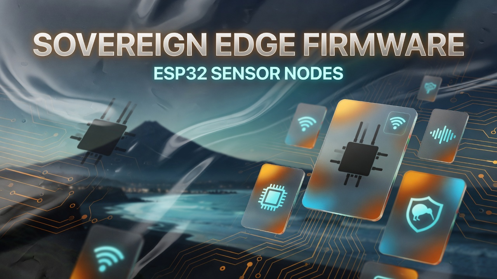
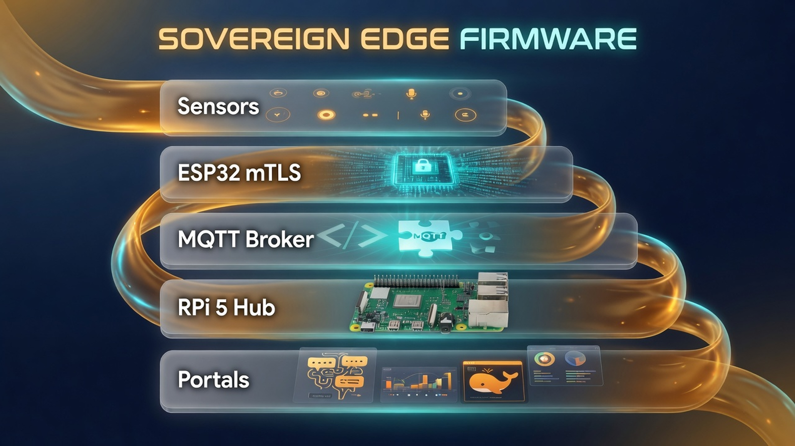

# Sovereign Edge Firmware

**Coastal Alpine Tech Limited** — pre-seed startup, New Plymouth, Taranaki, Aotearoa New Zealand.

Firmware repository for ESP32 edge nodes operating within the Sovereign AI Stack. 

## Architecture Overview

> **Diagrams:** Architecture images and Mermaid maps describe the **target product architecture** for this pre-seed stack. They are engineering design maps — not claims of large-scale commercial fleet deployment.

Field nodes run on **ESP32** with mTLS MQTT into a **Raspberry Pi 5 16GB** hub (AI HAT+ 2 / Hailo-10H capable). Sensor data stays on the local sovereign network.

### System map

| Layer | Components | Role |
| :--- | :--- | :--- |
| **Node** | ESP32 + sensors | Field capture |
| **Security** | mTLS + local JWT | No open MQTT |
| **Hub** | RPi 5 16GB | Broker · DB · UI |
| **Consumers** | Portals / Weaver | Edge AI stack |

## SecOps Notice
Never commit `secrets.h` to this repository. All physical node configurations must remain local to the deployment site.

---

## Garden Sensor Node (Arduino IDE Build)

A local, decentralized IoT sensor network for monitoring garden environmental metrics. This node publishes data to a Raspberry Pi 5 via MQTT, processed by Node-RED, and stored in InfluxDB 2 for local data sovereignty.

> **Note:** The PlatformIO build system (see `platformio.ini`) is used for the mTLS production firmware above. The Garden Sensor Node documented below uses **Arduino IDE (v1.8.19)** for rapid prototyping with the DHT11 and rain sensor. Both target the same ESP32 hardware.

### Hardware

| Component | Model & Details |
| --- | --- |
| **Microcontroller** | Keyestudio ESP32 (XC3800) |
| **Local Server** | Raspberry Pi 5 **16GB** (arm64) + AI HAT+ 2 (**Hailo-10H**, 40 TOPS) |
| **Temp/Humidity** | DHT11 (XC4520) |
| **Rain Sensor** | Duinotech Rain Sensor (XC4603) |

### Software & Infrastructure

* **OS:** Raspberry Pi OS / Debian Trixie
* **Firmware:** Arduino IDE (v1.8.19), ESP32 Core
* **Broker:** Mosquitto MQTT (v2.0.21-1)
* **Database:** InfluxDB 2 (v2.9.1-1)
* **Integration:** Node-RED (v5.0.0)

### Wiring Reference

| Sensor | Module Pin | ESP32 Pin | Notes |
| --- | --- | --- | --- |
| **DHT11** | S | GPIO4 | Ensure empty rows between pins to prevent shorts |
| **DHT11** | V | 5V | Direct to ESP32 currently |
| **DHT11** | G | GND | Direct to ESP32 currently |
| **Rain Sensor** | VCC | 5V Rail | Powered from shared breadboard rail |
| **Rain Sensor** | GND | GND Rail | Grounded to shared breadboard rail |
| **Rain Sensor** | AO | GPIO34 | ADC-capable input |
| **Rain Sensor** | DO | N/A | Unconnected |

> **⚠️ Warning:** Be incredibly careful with DHT11 pin placement. Placing S, V, and G in the same breadboard row will short the power to ground, causing a Pi 5 USB over-current event and knocking peripherals offline.

### Known Issues & Troubleshooting

* **Wi-Fi Connection Loops:** ESP32 SSIDs are strictly case-sensitive. Ensure your capitalization is perfectly matched.
* **Failed ESP32 Uploads:** The Pi 5 and ESP32 USB-to-UART combination can repeatedly drop out at high speeds. Hardcode your Arduino IDE upload speed to **115200 baud** to maintain stability.
* **Busy Serial Port:** If an upload fails, the IDE's Java process will often hold `/dev/ttyUSB0` hostage. Closing the Serial Monitor usually releases the lock.
* **Compiler/Linker Errors:** Repeated USB upload interruptions can eventually corrupt the ESP32 board package files (throwing EOF or getApbFrequency errors). Resolve this by deleting `~/.arduino15/packages/esp32` and reinstalling via the Boards Manager.

### Project Roadmap

* Confirm fresh ESP32 board package reinstall completes and compiling succeeds.
* Re-upload the combined sketch (DHT11 + rain sensor + MQTT) with a healthy compiler.
* Debug intermittent DHT11 reads (test migrating power from direct-ESP32 to the shared 5V rail).
* Complete Node-RED wiring for `garden/sensor1/rain` directly to InfluxDB.
* Integrate physical light and moisture sensors into the enclosure.
* Deploy Grafana to visualize the InfluxDB metrics.
* Configure persistent headless boot for all Pi services (`systemctl enable`).

---

For the full consolidated setup guide, see `garden-sensor-network-setup.md` (not yet published — the previous link pointed to a non-existent path).

Wayne Roberts, Coastal Alpine Tech Limited

## License

Proprietary — Coastal Alpine Tech Limited. See [LICENSE](./LICENSE).
